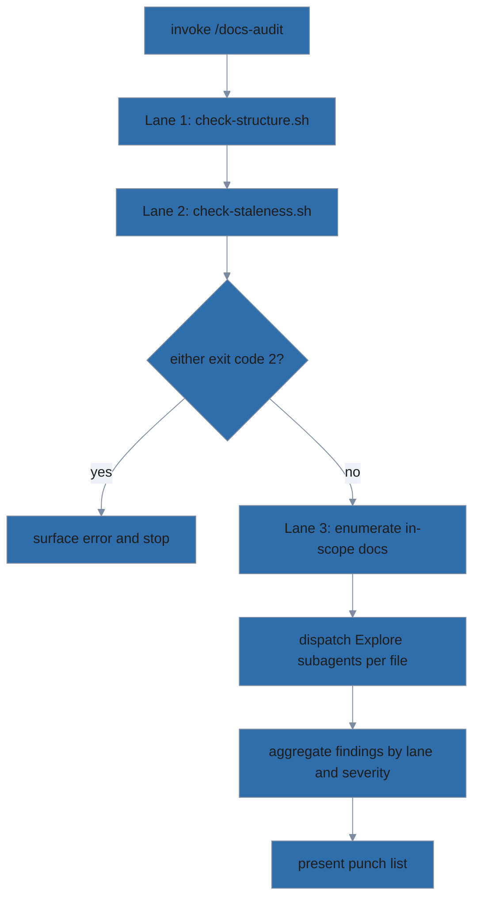

# /docs-audit

Read-only audit. Surfaces findings; never edits files. Run /docs-update
afterward to act on them.

## User-provided arguments

> $ARGUMENTS

## Instructions



### Activate the docs-organization skill

Invoke the `docs-organization` skill via your host's Skill tool. The skill's
`SKILL.md` defines `$SKILL_DIR` as the directory the host loaded it from
(`SKILL_DIR=$(dirname "$(realpath <loaded-skill-md>)")`). Reuse `$SKILL_DIR`
for every `scripts/...` and `reference/...` reference below — do not
hardcode `.claude/skills/...` or search candidate paths.

### Steps

1. Read `$SKILL_DIR/SKILL.md` for the invariants and principles this skill enforces. The procedure below is the source of truth for what to do.
2. **Lane 1 — Structural (fast):**
   - Run `bash $SKILL_DIR/scripts/check-structure.sh`.
   - Parse the JSON. Collect findings.
3. **Lane 2 — Staleness (fast):**
   - Run `bash $SKILL_DIR/scripts/check-staleness.sh`.
   - Parse JSON. Collect findings.
4. **Lane 3 — Content and diagram drift (slow, subagent-driven):**
   - Enumerate project documentation files per the scope rules in
     `$SKILL_DIR/SKILL.md` (§ "Scope of audit"). In
     short: `README.md`, every `.md` under `docs/`, and (for skill-pack
     repos) project-shipped docs under `module/`. **Exclude** anything
     matched by `.gitignore`, anything under a dot-directory (`.git/`,
     `.claude/`, `.opencode/`, `.lola/`, etc.), and LLM-configuration
     files (`CLAUDE.md`, `AGENTS.md`, `GEMINI.md`, `.cursorrules`).
   - Use the agent host's built-in glob tool (Claude Code: `Glob`), not
     shell `find`, for portability and structured output.
   - For each enumerated file:
     - Dispatch an `Explore`-type subagent with two prompts (separately,
       so findings can be attributed):
       1. **Content drift:** "Read <file>. Identify any specific claims in
          this document that no longer match the code in this repository.
          Return a list of `file:line` citations with what the doc says vs
          what the code actually does. Do not edit any file. Reply in
          under 300 words."
       2. **Missing diagrams (info-level encouragement, strict bar):**
          "Read <file>. Identify sections where adding a mermaid diagram
          would actively clarify a complicated concept — not restate a
          simple list. A candidate must satisfy **both**: (a) the
          relationships are non-obvious from a linear top-to-bottom
          read (real branching, parallelism, state transitions, or
          non-trivial component interactions); and (b) the reader would
          have to mentally render a diagram anyway to follow the prose.
          Reject candidates that are linear procedures with at most one
          binary branch, already drawn as text (directory trees,
          install steps, tables), small matrices better served by a
          table, or three-item role lists framed as 'pipelines'. For
          each surviving candidate, return a `MISSING_DIAGRAM` finding
          with the section heading, fitting type (flowchart /
          sequenceDiagram / stateDiagram-v2 / erDiagram), and a
          one-sentence justification that names *what's non-obvious*
          the diagram would expose. Severity is info (never blocker).
          Reply in under 200 words. If no candidates exist, return an
          empty list — do not invent."
   - For each `.mmd` file or fenced ```mermaid block found within the
     enumerated documentation files (same scope rules apply — skip
     dot-directories, gitignored paths, and LLM-config files):
     - Dispatch an `Explore`-type subagent: "Read this diagram and the code
       it depicts. Identify nodes/edges that reference subsystems no longer
       in the code. Reply in under 200 words."
5. Aggregate findings from all three lanes and present a structured
   punch list. **This format is the contract `/docs-update` parses** from
   conversation context, so it must be regular:
   - A one-line summary: counts by severity (e.g., `1 blocker, 0 warnings,
     4 info`).
   - For each non-empty severity, a markdown table with these columns:
     `| Code | File | Line | Note |` where:
     - `Code` is the finding code (e.g., `MISSING_DIAGRAM`,
       `STALE_README`, `MISSING_GITIGNORE_SUPERPOWERS`,
       `MISSING_HOUSE_STYLE_HEADER`).
     - `File` is the repo-relative path.
     - `Line` is the relevant line number, or `—` if not applicable.
     - `Note` carries the data `/docs-update` needs to act on the
       finding:
       - `MISSING_DIAGRAM`: section heading, suggested diagram type
         (`flowchart` / `sequenceDiagram` / `stateDiagram-v2` /
         `erDiagram`), and the one-sentence justification.
       - Content/diagram drift: what the doc claims vs. what the code
         shows, with a code citation.
       - Mechanical codes: usually no extra detail needed.
   - If a finding doesn't fit the schema, list it under a separate
     "Other" subsection rather than mangling the table.
6. **Do not write any files.** Offer: "Run /docs-update to fix these
   findings interactively."

## Stop conditions

- If `check-structure.sh` or `check-staleness.sh` exits 2 (internal error):
  surface the error to the user; do not proceed to Lane 3.
- If Lane 3 subagents fail (timeout, structural error): include those as
  Warning findings ("could not audit X — re-run or inspect manually")
  rather than silently dropping.
