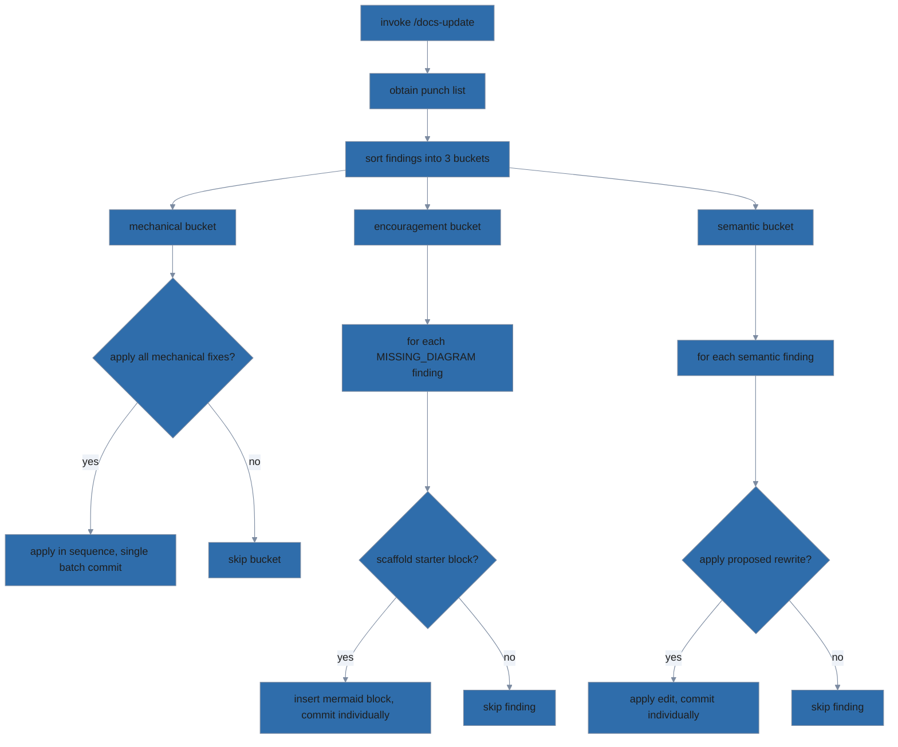

# /docs-update

Take a punch list from /docs-audit and apply fixes interactively. Mechanical
fixes (gitignore entries, missing template files) get one batch confirmation;
semantic fixes (rewriting paragraphs) get per-fix confirmation.

## User-provided arguments

> $ARGUMENTS

## Instructions



### Locate the docs-organization skill bundle

Before running any script or reading any reference file shipped with the
docs-organization skill, locate the skill bundle on disk by checking these
locations in order and using the first that exists:

1. **Project-local skills directory** for your agent host
   (e.g., `.claude/skills/docs-organization/` under Claude Code, or the
   equivalent project-scoped skills path for your host).
2. **User-global skills directory** for your agent host
   (e.g., `~/.claude/skills/docs-organization/` under Claude Code,
   `~/.config/opencode/skills/docs-organization/` under OpenCode, or
   wherever your host installs user-scoped skill packs).
3. **Plugin-bundled location**, if your host installs skills as part of a
   plugin pack (e.g., `~/.claude/plugins/*/skills/docs-organization/`).
4. **Dev-workspace fallback**: `module/skills/docs-organization/` — this
   only resolves when running inside the pack's own source repository.

Use the agent host's filesystem tools (e.g., `Glob`, or `bash` for `ls`)
to check each candidate. Bind the first existing path to `$SKILL_DIR`.
If more than one candidate exists, prefer the most recently modified — if
that's ambiguous, ask the user which to use. Every `scripts/...` and
`reference/...` path below is relative to `$SKILL_DIR`.

This command also calls into the companion **adr** skill for one finding
(`MISSING_ADR_INDEX`). Locate that bundle using the same procedure with
skill name `adr` (so the candidate paths become
`.claude/skills/adr/`, `~/.claude/skills/adr/`, etc.), and bind the first
existing path to `$ADR_DIR`. If no `MISSING_ADR_INDEX` finding is present
in the punch list, you can skip this lookup.

### Steps

1. Read `$SKILL_DIR/SKILL.md` for the invariants and principles this skill enforces. The procedure below is the source of truth for what to do.
2. **Obtain the punch list:**
   - If `$ARGUMENTS` is a path to a saved audit output, parse it.
   - Otherwise, run /docs-audit's three lanes inline to produce a fresh
     punch list.
3. **Sort findings into three buckets:**
   - **Mechanical:** `MISSING_GITIGNORE_SUPERPOWERS`, `SUPERPOWERS_IN_GIT`,
     `MISSING_ADR_INDEX`, `MISSING_HOUSE_STYLE_HEADER`, missing template
     files. Each has a deterministic fix.
   - **Encouragement (info-level):** `MISSING_DIAGRAM` — the audit
     suggested a section that would benefit from a diagram. Each gets an
     individual offer ("section X looks like a candidate for a Y diagram —
     scaffold a starter mermaid block under that heading?"). Skip by
     default if the user declines; never auto-apply.
   - **Semantic:** content drift, diagram drift, `STALE_README`, `STALE_DOC`
     findings, and anything else needing judgment.
4. **Apply mechanical fixes:**
   - Show the user the full list of mechanical fixes. Ask once: "Apply all
     mechanical fixes?" If yes, apply them in sequence.
   - Specific fixes:
     - `MISSING_GITIGNORE_SUPERPOWERS`: append `docs/superpowers/` to
       `.gitignore`.
     - `SUPERPOWERS_IN_GIT`: `git rm --cached <each tracked file>`.
     - `MISSING_ADR_INDEX`: run `bash $ADR_DIR/scripts/adr-index.sh
       <adr-dir>`.
     - `MISSING_HOUSE_STYLE_HEADER`: read
       `$SKILL_DIR/reference/mermaid-house-style.md`,
       prepend the required init header to each affected diagram.
     - Missing template files: read the relevant template from `reference/`
       and write it.
   - **Lint before commit:** if any mechanical fix modified a `.mmd` file
     or a `.md` file containing a fenced ```mermaid block, run
     `node $SKILL_DIR/scripts/lint-mermaid.mjs <file>`
     and confirm `status: ok` before staging.
   - Commit as a batch: `docs: apply structural fixes from /docs-audit`.

5a. **Apply encouragement fixes via batch selection:**

   The encouragement bucket is info-level by design. Findings are
   *nudges*: independent, optional, and the author's main question is
   "which of these is worth my time?" — not "should I do this specific
   one?". Replace per-finding gates with one ranked menu.

   - **Rank candidates by likely value before presenting.** Diagram types
     differ in how dramatically they beat prose:
     - `stateDiagram-v2` / `erDiagram` — the concept *is* a graph (state
       machine, entity relationships). Prose has to enumerate every
       edge. **Highest value.**
     - `flowchart` with decision nodes — branching logic that flattens
       awkwardly into nested bullets. **High value.**
     - `flowchart` for component layout or pipeline stages — useful but
       bullet lists carry similar content. **Medium value.**
     - `sequenceDiagram` — valuable only when actor identity *and*
       ordering both matter. Otherwise a numbered list works.
       **Medium value.**
   - Present all candidates in a single multi-select prompt ordered by
     rank, each row showing: file, section heading, suggested diagram
     type, one-sentence justification. **Selecting none is a valid
     outcome** — never auto-apply, and never warn about declining.
   - For each selected finding, in order:
     1. Read `$SKILL_DIR/reference/mermaid-house-style.md`
        — both the init header *and* the **Syntax constraints** section.
        The syntax constraints are non-obvious and load-bearing: violate
        them and the first lint will fail.
     2. Read the section's surrounding prose to ground the scaffold.
        Node names come from concepts the section already names; edges
        reflect relationships it already describes. **Do not emit
        generic `A --> B` placeholders** — a grounded skeleton is much
        faster for the author to refine than an empty one.
     3. Insert the fenced ```mermaid block immediately after the section
        heading, before any prose in the section body.
     4. **Lint before commit:** run
        `node $SKILL_DIR/scripts/lint-mermaid.mjs <file>`
        and confirm `status: ok`. If a `SYNTAX_ERROR` appears, consult
        the **Syntax constraints** section in the house-style reference
        and fix before committing.
     5. Commit individually with the file basename in the subject so
        commits across multiple files don't collide:
        `docs(<basename>): scaffold <diagram-type> under "<section>"`.
        Examples:
        - `docs(adr-skill): scaffold stateDiagram-v2 under "Status workflow"`
        - `docs(docs-audit): scaffold flowchart under "Instructions"`

5. **Apply semantic fixes one at a time:**
   - For each semantic finding, show the user:
     - The file and location.
     - What the doc currently says (exact excerpt).
     - What the code actually does (citation).
     - Proposed rewrite.
   - Ask: "Apply this fix?" Wait for yes/no/skip.
   - On yes, apply the edit.
   - **Lint before commit:** if the edit touches a `.mmd` file or a
     fenced ```mermaid block, run
     `node $SKILL_DIR/scripts/lint-mermaid.mjs <file>`
     and confirm `status: ok`.
   - Commit individually with a message referencing the finding. For
     fixes that touch a single file, include the basename in the subject:
     `docs(<basename>): <imperative summary>`.

## Stop conditions

- If the user refuses a mechanical fix, skip it and continue with the rest.
- If a fix would require an LLM to invent content (no clear source of truth):
  surface as a "needs manual rewrite" item and do not attempt automatically.
