# adr

> **Helper paths.** Every `scripts/<x>` and `reference/<x>` reference in this
> file is relative to the directory that contains this `SKILL.md`. Anchor on
> the loaded path (`SKILL_DIR=$(dirname "$(realpath <skill-md>)")`) and
> resolve every helper as `"$SKILL_DIR/scripts/<x>"` or
> `"$SKILL_DIR/reference/<x>"`. Do not hardcode `.claude/skills/...` or
> search candidate paths — the install destination varies by host and scope,
> but helpers are always next to the loaded `SKILL.md`.

Manage Architectural Decision Records using MADR 4.0. Never auto-invoked.
All behavior is reached through two slash commands:

- `/adr-new <title>` — draft a new ADR with inline self-review, status proposed
- `/adr-review <NNNN>` — independent rubric review via a context-isolated subagent

## Where ADRs live

The skill resolves the ADR directory by precedence:

1. `docs/dev/adr/` if `docs/dev/` exists.
2. `docs/adr/` otherwise.
3. If neither parent exists, create `docs/dev/adr/`.

Each ADR file is named `NNNN-short-slug.md` with NNNN zero-padded
sequential (0001, 0002, …). The directory contains an `index.md`
regenerated by `scripts/adr-index.sh` after every new ADR and every
status change.

## Status workflow

```mermaid
%%{init: {'theme': 'base', 'themeVariables': {
  'primaryColor': '#2f6dab',
  'primaryTextColor': '#1e1e1e',
  'primaryBorderColor': '#7c8ba1',
  'lineColor': '#7c8ba1',
  'edgeLabelBackground': '#eef2f8',
  'tertiaryColor': 'transparent',
  'tertiaryTextColor': '#7c8ba1',
  'tertiaryBorderColor': '#7c8ba1',
  'clusterBkg': 'transparent',
  'clusterBorder': '#7c8ba1',
  'titleColor': '#7c8ba1',
  'noteBkgColor': '#eef2f8',
  'noteTextColor': '#1e1e1e',
  'fontFamily': 'system-ui, sans-serif'
}, 'themeCSS': '.node .nodeLabel{color:#ffffff!important;fill:#ffffff!important;}'}}%%
stateDiagram-v2
  [*] --> proposed: /adr-new
  proposed --> reviewed: /adr-review
  reviewed --> accepted: manual frontmatter edit
  accepted --> superseded: superseded by new ADR
  proposed --> rejected: manual frontmatter edit
  reviewed --> rejected: manual frontmatter edit
  rejected --> [*]
  superseded --> [*]
```

- `proposed` — set by `/adr-new`. Initial state.
- `reviewed` — set by `/adr-review` after gaps from the rubric have been
  addressed or explicitly skipped by the user.
- `accepted` — set manually by the user (edit the frontmatter). The skill
  never advances to this status automatically.
- `rejected` — terminal state, set manually.
- `superseded by NNNN` — terminal state, set manually. The superseding
  ADR should link back in its "More Information" section.

## Tools this skill uses

- `scripts/adr-index.sh <adr-dir>` — regenerates index.md by reading
  each ADR's frontmatter (status, date) and first H1 (title). Idempotent.
- Subagent dispatch (general-purpose type) for /adr-review — provides
  context isolation. The subagent prompt is fully self-contained: paths,
  rubric reference, expected JSON output shape.

## References

- `reference/madr-template.md` — the full MADR 4.0 template that
  `/adr-new` instantiates.
- `reference/review-rubric.md` — the rubric `/adr-review` applies via
  subagent.
- `reference/example-adr.md` — a filled ADR that clears the review rubric,
  shown as a target for `/adr-new` output.

## Cross-skill

This skill does not touch general documentation or diagrams. The
companion `docs-organization` skill (same pack) owns README/docs
structure and mermaid diagrams. ADRs are part of the developer docs
tree but their lifecycle is managed here.
