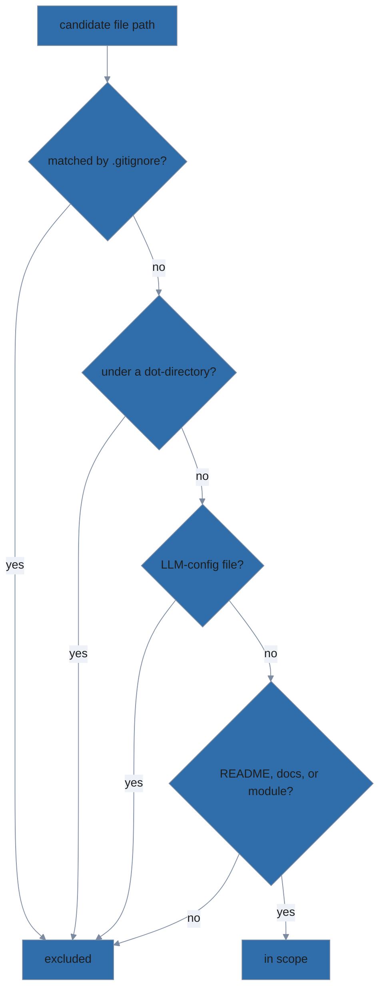

# docs-organization

This skill keeps a project's documentation organized and current. It is
**never auto-invoked**. All behavior is reached through one of four slash
commands:

- `/docs-init` — bootstrap or extend project doc structure
- `/docs-audit` — find drift between code and docs (read-only)
- `/docs-update` — apply fixes for drift findings
- `/diagram-test` — lint every mermaid diagram

## Invariants this skill enforces

1. **README.md is always self-sufficient.** Even after detailed usage docs
   move to `docs/usage/`, the README must provide enough Install +
   Quickstart for a new user to get started.
2. **`docs/superpowers/` is never committed.** It contains specs and plans
   that are working artifacts, not project deliverables. Enforced via
   `.gitignore` and via `check-structure.sh`'s `SUPERPOWERS_IN_GIT` check.
3. **Developer docs live under `docs/dev/`** when a project has them.
   `docs/dev/adr/` (or `docs/adr/` for legacy layouts) holds ADRs.
4. **Every mermaid diagram passes the house-style lint:** init header
   present, classDef names in the approved palette, text/fill contrast
   ≥ 4.5:1 (AA) and fill/background contrast ≥ 3.0:1 (graphical objects)
   for both light and dark reference backgrounds.

## Scope of audit

The skill audits **project-centric documentation only** — content that
describes the project itself. When enumerating documentation files (in
`/docs-audit` and any command that re-runs its lanes), include:

- `README.md` at the repository root.
- Every `.md` under `docs/`.
- For skill-pack repositories: every `.md` under `module/` that ships as
  part of the pack (`module/skills/*/SKILL.md`, `module/commands/*.md`,
  `module/skills/*/reference/*.md`).

**Exclude unconditionally:**

- Any path matched by `.gitignore` (e.g., `docs/superpowers/`,
  `node_modules/`, build artifacts).
- Any directory whose name starts with `.`. These are tool/agent-runtime
  spaces (`.git/`, `.claude/`, `.opencode/`, `.lola/`, `.gemini/`,
  `.cursor/`) and never contain project documentation. A single
  structural rule covers existing and future agent hosts without an
  enumerated allowlist.
- LLM-configuration files at any level: `CLAUDE.md`, `AGENTS.md`,
  `GEMINI.md`, `.cursorrules`. These describe agent behavior; they drift
  with prompt-engineering iteration rather than with code, so auditing
  them for code drift produces noise.

**Tooling preference:** when enumerating files, prefer the agent host's
built-in glob/search tools (e.g., Claude Code's `Glob` and `Grep`) over
shell `find` / `grep`. Built-ins are faster, portable across platforms,
and return structured output without shell-escaping concerns. Shell
tools are still appropriate for the deterministic scripts under
`scripts/`, which run outside the agent.

## Diagrams are actively encouraged

This skill is not a passive linter — it actively nudges authors to add
diagrams where they would clarify concepts. `/docs-audit` surfaces
`MISSING_DIAGRAM` (info-level) findings when prose sections describe
something a diagram would communicate faster than words: architecture,
multi-step interactions, state transitions, branching decisions, data
flow, or entity relationships. `/docs-update` offers to scaffold a
starter mermaid block under the flagged section heading. Findings are
info-level — never blockers. Authors are nudged, not forced.

The full concept-to-diagram-type table (with rationale for each pairing)
lives in `reference/mermaid-house-style.md`. Consult it when emitting
`MISSING_DIAGRAM` findings or when scaffolding a starter block, so the
suggestion matches the documented mapping.

## Tools this skill uses

All scripts return JSON to stdout. Each script's exit code:
0 = no findings, 1 = findings, 2 = internal error.

- `scripts/check-structure.sh` — file presence, `.gitignore`, ADR index.
- `scripts/check-staleness.sh` — git log delta between docs and source.
- `scripts/lint-mermaid.mjs` — merval parse, init header, palette,
  contrast.

Requires Node.js ≥20 and one npm dep (`@aj-archipelago/merval`).

**First-run setup after `lola install`.** lola installs the pack files but
does not run `npm install`. The first invocation of `/diagram-test` after
a fresh pack install will emit a `MERVAL_NOT_INSTALLED` blocker finding
that names the exact directory and command needed. Surface the finding's
message verbatim to the user — it tells them precisely what to run.

For pack developers, `task install` runs both the lola install and the
npm install in one step.

## References

- `reference/mermaid-house-style.md` — palette, init header, examples,
  and **merval syntax constraints** (the strict-subset gotchas every
  diagram in this project must follow; consult before scaffolding).
- `reference/readme-template.md` — minimum acceptable README structure.
- `reference/docs-tree-template.md` — `docs/dev/` scaffold.

## Cross-skill

This skill does not touch ADRs directly. The companion `adr` skill (same
pack) owns `docs/dev/adr/` content via `/adr-new` and `/adr-review`. The
two skills share knowledge of the `docs/` layout but have separate
responsibilities.
