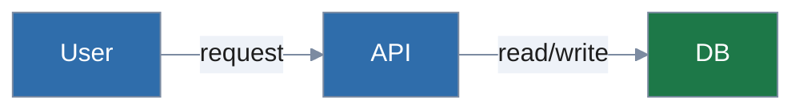

# docs/ scaffold

`/docs-init` creates this layout when called on a project that needs
developer documentation. Each file below is created with placeholder
content the user fills in.

```
docs/
  usage/                       # only when /docs-audit recommends a split
    README.md                  # index page for usage docs
  dev/
    README.md                  # index page for developer docs
    architecture.md            # system overview, key modules, why
    contributing.md            # how to set up dev env, run tests, submit PRs
    diagrams/                  # .mmd files referenced from other docs
    adr/
      index.md                 # auto-generated by adr-index.sh
      # NNNN-*.md files appear here
```

## File contents on init

### docs/dev/README.md

````markdown
# Developer documentation

This is the maintainer-facing documentation. End users should start at the
top-level README.md.

- [Architecture](architecture.md)
- [Contributing](contributing.md)
- [Architectural Decision Records](adr/index.md)
- [Diagrams](diagrams/)
````

### docs/dev/architecture.md

````markdown
# Architecture

> Fill in: what does this system do, what are its major pieces, and how do
> they fit together?

## Major components

(list each one with one-paragraph description)

## Data flow

(describe how requests/data move through the system)

## Diagram

A diagram of how the major components connect. Edit the placeholder below
to reflect your actual subsystems — keep the house-style init header
and use `classDef sysA` through `sysF` for distinct subsystems. See
`reference/mermaid-house-style.md` for the full palette and guidance on
when other diagram types fit better.

<!-- starter mermaid block -->


Larger diagrams should live in their own `.mmd` files under
`docs/dev/diagrams/` and be referenced from here.
````

### docs/dev/contributing.md

````markdown
# Contributing

## Dev setup

(commands to get a working dev environment)

## Running tests

(commands and what to expect)

## Submitting changes

(branch naming, PR expectations, commit message conventions)
````
