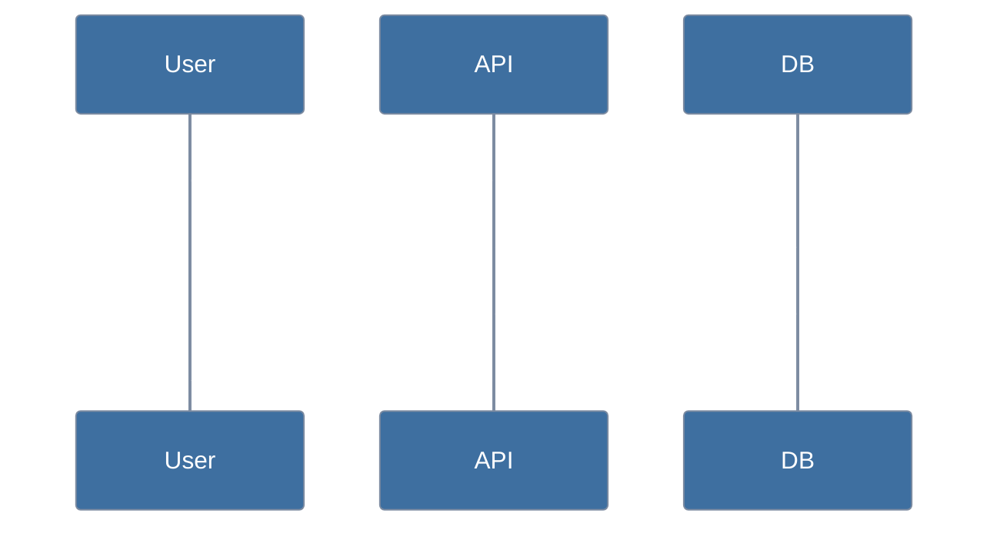

# Mermaid house style

Every diagram in this project must begin with the required init header and
use `classDef` entries drawn from the approved palette below. `/diagram-test`
enforces these rules.

## When to use a diagram

Diagrams clarify concepts that prose alone obscures. Reach for one when you
catch yourself writing any of these:

| If you're describing… | Use a… | Why |
|---|---|---|
| How subsystems connect to each other | `flowchart` (or C4 component) | A node-and-edge picture is faster than a paragraph naming each connection |
| A multi-step interaction between actors over time | `sequenceDiagram` | Time-ordered arrows expose causality that prose hides |
| A state that transitions through phases | `stateDiagram-v2` | Visible cycles and dead ends that lists of states never show |
| A branching decision the reader must follow | `flowchart` with decision nodes | The branches are the point — prose linearizes them |
| Data shape moving through stages of a pipeline | `flowchart LR` with annotated edges | Shape-at-each-stage is easier to track than chained sentences |
| A relationship between entities or models | `erDiagram` | One-to-many vs. many-to-many is a diagram's natural domain |

A diagram is not required for: a single linear sequence (use a numbered
list), a fixed list of values (use a table), an isolated concept (use
prose). Don't draw a diagram to prove you can.

When you do reach for one, follow the house style below so the diagram
stays legible regardless of light or dark page backgrounds.

## Required init header

Paste this at the top of every `.mmd` file and every fenced ```mermaid block:

```
%%{init: {'theme': 'base', 'themeVariables': {
  'primaryColor': '#3e6fa0',
  'primaryTextColor': '#ffffff',
  'primaryBorderColor': '#7c8ba1',
  'lineColor': '#7c8ba1',
  'edgeLabelBackground': '#f5f5f5',
  'fontFamily': 'system-ui, sans-serif'
}}}%%
```

## Syntax constraints

`lint-mermaid.mjs` parses diagrams with merval, whose grammar is a strict
subset of what the mermaid live editor accepts. The following rules are
the difference — every diagram in this project must follow them, even if
your browser renders looser syntax cleanly:

1. **Quote labels containing `:`, `,`, `(`, or `)`.** Use double quotes
   inside the node delimiter:
   - `B["Lane 1: structural"]` not `B[Lane 1: structural]`
   - `D{"matches, or not?"}` not `D{matches, or not?}`
   - `E["pipeline (stage 2)"]` not `E[pipeline (stage 2)]`
2. **Stadium shape `([text])` is not supported.** Use rectangles
   `[text]` or rounded rectangles `(text)` instead. Quoting does not
   help — the shape itself is unrecognized.
3. **These work unquoted:** `/` slashes, `?` question marks, `<br/>`
   line breaks, hyphens, ampersands.

Rule of thumb: if a label contains any of the four characters in rule 1,
wrap the whole label in `"…"`. Cost is negligible; debugging a
`SYNTAX_ERROR` mid-commit is not.

## Approved palette

Each class is a fill+text pair, chosen so that:

- Text vs fill ≥ 4.5:1 (WCAG AA — text always legible regardless of background)
- Fill vs `#ffffff` (light bg) ≥ 3.0:1 (WCAG threshold for non-text graphics)
- Fill vs `#1e1e1e` (dark bg) ≥ 3.0:1 (same)

These thresholds are the geometric maximum: requiring fills to clear AA
(4.5:1) against *both* light and dark backgrounds is impossible — those
constraints push the fill's luminance in opposite directions. The 3.0:1
threshold for fill-on-bg is WCAG's official criterion for graphical objects.

| Class  | Purpose          | Fill      | Text      |
|--------|------------------|-----------|-----------|
| sysA   | first subsystem  | `#3e6fa0` | `#ffffff` |
| sysB   | second subsystem | `#3a8054` | `#ffffff` |
| sysC   | third subsystem  | `#a55726` | `#ffffff` |
| sysD   | fourth subsystem | `#7457b8` | `#ffffff` |
| sysE   | fifth subsystem  | `#2d747e` | `#ffffff` |
| sysF   | sixth subsystem  | `#5a6a7e` | `#ffffff` |

Assign nodes to a class with `class <node1>,<node2> <className>` or
`<node>:::<className>`.

## Worked examples

### Flowchart


### Sequence



## Why these rules

Mermaid renders inline in markdown viewers and assistant chat panes that may
use either light or dark page backgrounds. Without explicit colors, mermaid's
default theme produces near-white nodes that vanish on a light background and
washed-out text that vanishes on a dark one.

The palette here lands every fill in the narrow ~[0.13, 0.183] WCAG luminance
band, which is the only range where a single color clears 3.0:1 contrast
against *both* light (`#ffffff`) and dark (`#1e1e1e`) reference backgrounds.
White text on those fills clears the WCAG AA 4.5:1 threshold for text
legibility. Going to AAA (7:1) for text would shrink the viable band to
empty — those constraints push the fill's luminance in opposite directions.

## Opting out

If a diagram needs a one-off color outside the palette (rare — accessibility
guarantees go away), add `<!-- lint-mermaid:allow-classname=<name> -->` on
the line immediately before the offending `classDef`. The check still runs
on contrast; only the approved-name rule is suppressed.
