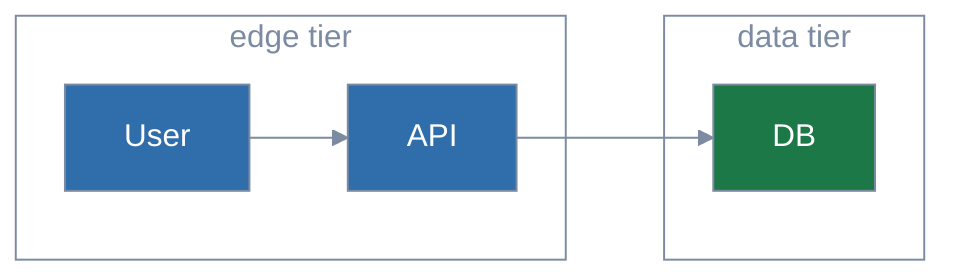

# Mermaid house style

Every diagram begins with a palette init header and uses `classDef` entries
from the approved palette. `/diagram-test` enforces this.

## Pick a palette

| Palette | Mood | Cluster shape | Backgrounds |
|---------|------|---------------|-------------|
| **Solar** (default) | Cool jewel tones (sapphire, emerald, amethyst, teal, indigo, slate) | Outlined transparent | Light + dark |
| **Federation** | Cool balanced (steel blue, forest green, terracotta, violet, deep teal, slate) | Outlined transparent | Light + dark |
| **Citrus** | Warm earth (terracotta, olive, amber, burgundy, sand, slate) | Outlined transparent | Light + dark |
| **Parchment** | Federation colors + filled beige clusters | Filled pale neutral | **Light only** |

Palette JSONs live next to this file in `palettes/`. ER diagrams also need
`palettes/er-overrides.css` at render time — `/diagram-test` applies it
automatically; direct `mmdc` users pass `--cssFile`.

## When to reach for a diagram

| Describing… | Use… | Why |
|---|---|---|
| How subsystems connect | `flowchart` (or C4) | A node-and-edge picture beats a paragraph naming connections |
| Multi-actor interaction over time | `sequenceDiagram` | Time-ordered arrows expose causality |
| State transitioning through phases | `stateDiagram-v2` | Cycles and dead ends become visible |
| A branching decision | `flowchart` with decision nodes | Branches are the point — prose linearizes them |
| Data flowing through pipeline stages | `flowchart LR` with annotated edges | Shape-at-each-stage is hard to track in prose |
| Entity / model relationships | `erDiagram` | One-to-many vs. many-to-many is a diagram's domain |

Skip the diagram for: a single linear sequence (use a numbered list), a
fixed list (use a table), an isolated concept (use prose).

## Init header (Solar — the default)

Paste this at the top of every `.mmd` file and every fenced ` ```mermaid `
block:

```text
%%{init: {'theme': 'base', 'themeVariables': {
  'primaryColor': '#2f6dab',
  'primaryTextColor': '#1e1e1e',
  'primaryBorderColor': '#7c8ba1',
  'lineColor': '#7c8ba1',
  'edgeLabelBackground': '#eef2f8',
  'tertiaryColor': 'transparent',
  'tertiaryTextColor': '#7c8ba1',
  'tertiaryBorderColor': '#7c8ba1',
  'clusterBkg': 'transparent',
  'clusterBorder': '#7c8ba1',
  'titleColor': '#7c8ba1',
  'noteBkgColor': '#eef2f8',
  'noteTextColor': '#1e1e1e',
  'fontFamily': 'system-ui, sans-serif'
}, 'themeCSS': '.node .nodeLabel{color:#ffffff!important;fill:#ffffff!important;}'}}%%
```

Then for any nodes you want palette-colored, add classDefs at the bottom
(only those used):

```text
  classDef sysA fill:#2f6dab,color:#ffffff,stroke:#7c8ba1
  classDef sysB fill:#1d7848,color:#ffffff,stroke:#7c8ba1
  classDef sysC fill:#7457b8,color:#ffffff,stroke:#7c8ba1
  classDef sysD fill:#2d747e,color:#ffffff,stroke:#7c8ba1
  classDef sysE fill:#4d68c4,color:#ffffff,stroke:#7c8ba1
  classDef sysF fill:#5c6a82,color:#ffffff,stroke:#7c8ba1
```

Apply with `class <node1>,<node2> <className>`. The inline form
`<node>:::<className>` is rejected by the linter for nodes with explicit
shapes.

## Switching palette

Each non-default palette overrides only the colors. Take the Solar header
above and substitute the values from this table:

| Variable               | Solar       | Federation  | Citrus      | Parchment   |
|------------------------|-------------|-------------|-------------|-------------|
| `primaryColor`         | `#2f6dab`   | `#3e6fa0`   | `#a55726`   | `#3e6fa0`   |
| `primaryBorderColor`   | `#7c8ba1`   | `#7c8ba1`   | `#9a8770`   | `#8d8475`   |
| `lineColor`            | `#7c8ba1`   | `#7c8ba1`   | `#9a8770`   | `#8d8475`   |
| `edgeLabelBackground`  | `#eef2f8`   | `#f5f5f5`   | `#f5f0e8`   | `#ffffff`   |
| `tertiaryTextColor`    | `#7c8ba1`   | `#7c8ba1`   | `#9a8770`   | `#3a342c`   |
| `tertiaryBorderColor`  | `#7c8ba1`   | `#7c8ba1`   | `#9a8770`   | `#8d8475`   |
| `clusterBkg`           | transparent | transparent | transparent | `#ebe7df`   |
| `clusterBorder`        | `#7c8ba1`   | `#7c8ba1`   | `#9a8770`   | `#8d8475`   |
| `titleColor`           | `#7c8ba1`   | `#7c8ba1`   | `#9a8770`   | `#3a342c`   |
| `noteBkgColor`         | `#eef2f8`   | `#f5f5f5`   | `#f5f0e8`   | `#ffffff`   |
| `tertiaryColor`        | transparent | transparent | transparent | `#ebe7df`   |

classDef fills:

| Class | Solar      | Federation | Citrus     | Parchment (= Federation) |
|-------|------------|------------|------------|--------------------------|
| sysA  | `#2f6dab`  | `#3e6fa0`  | `#a55726`  | `#3e6fa0`                |
| sysB  | `#1d7848`  | `#3a8054`  | `#5f7a23`  | `#3a8054`                |
| sysC  | `#7457b8`  | `#a55726`  | `#9b6320`  | `#a55726`                |
| sysD  | `#2d747e`  | `#7457b8`  | `#a64a72`  | `#7457b8`                |
| sysE  | `#4d68c4`  | `#2d747e`  | `#8e6e3a`  | `#2d747e`                |
| sysF  | `#5c6a82`  | `#5a6a7e`  | `#5a6a7e`  | `#5a6a7e`                |

Node text is `#ffffff` (white) in every palette. The `themeCSS` snippet in
the init header forces white text on default (non-classDef'd) nodes so
diagrams render correctly without per-node classDefs.

## Syntax constraints

The linter uses merval, a strict subset of mermaid's grammar:

1. **Quote labels containing `:`, `,`, `(`, or `)`** — `B["Lane 1: structural"]` not `B[Lane 1: structural]`.
2. **Stadium shape `([text])` is not supported.** Use `[text]` or `(text)`.
3. **Inline class `node["label"]:::sysX` is rejected** for nodes with explicit shapes. Use `class node1,node2 sysA` instead.
4. `/`, `?`, `<br/>`, hyphens, and ampersands work unquoted.

## ER edge labels — known mermaid quirk

Mermaid hardcodes `.labelBkg { background-color: rgba(0, 0, 0, 0.5); }` in
its emitted SVG for ER relationship labels, ignoring theme variables.
`palettes/er-overrides.css` restores legibility by forcing a light pill
background with dark text. `/diagram-test` applies it via `--cssFile`
automatically.

## Worked example



## Why this design

Mermaid renders inline in markdown viewers and chat panes that may use
either light or dark backgrounds. The four palettes land node fills in the
narrow WCAG luminance band `[0.13, 0.183]` — the only range where a fill
clears 3:1 contrast against both `#ffffff` and `#1e1e1e`. White node text
on those fills clears 4.5:1 (AA). Mid-tone canvas/cluster text clears 3:1
(AA Large) on both backgrounds.

Setting `primaryTextColor: '#1e1e1e'` (dark) keeps edge labels, axis
labels, ER attributes, sankey/radar/quadrant text legible. The `themeCSS`
override then forces white text on node fills so default nodes still read
correctly without a classDef.

## Opting out

For a one-off color outside the palette, add
`<!-- lint-mermaid:allow-classname=<name> -->` on the line immediately
before the offending `classDef`. Contrast still runs; only the
approved-name check is suppressed.
